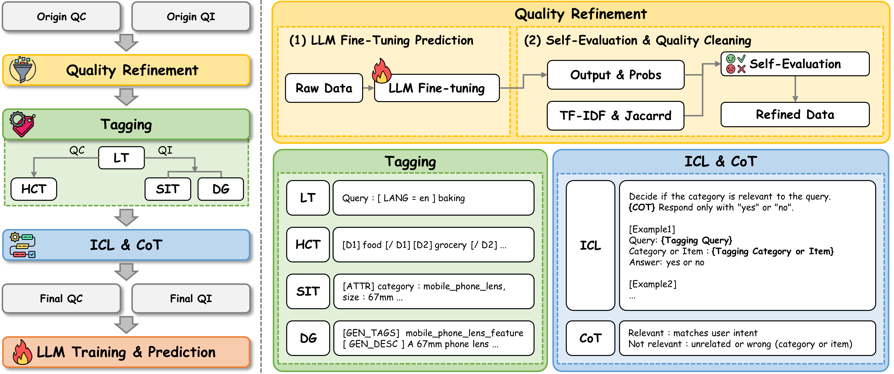

# DILAB Team Solution for Alibaba International E-commerce Product Search Competition

This repository contains our solution for the competition.  
The codebase is organized for **reproducibility** and requires only running the provided scripts to reproduce preprocessing, training, and inference.
<p align="center">
  
</p>


---

## 1. Environment Setup
This project uses two separate environments:

- `cikm_vllm`: for **data preprocessing**
- `cikm_run`: for **fine-tuning and inference**

Each has its own requirements file:

- `requirements_preprocess.txt`
- `requirements_finetune.txt`

Example setup:
```bash
# Preprocessing environment
conda create -n cikm_vllm python=3.11
conda activate cikm_vllm
pip install -r requirements_preprocess.txt

# Fine-tuning & inference environment (CUDA 12.1, PyTorch 2.2+)
conda create -n cikm_run python=3.11
conda activate cikm_run
pip install -r requirements_finetune.txt
````

---

## 2. Data Preprocessing

The QC and QI datasets are processed using an integrated pipeline that converts raw data into train/test sets in two stages:
1. **Refinement** – improves data quality  
2. **Preprocessing** – applies tagging and format conversion

```bash
# Stage 1: Quality Refinement
bash script/quality_refinement.sh

# Stage 2: Preprocessing refined data
bash script/data_preprocess.sh
```

* Input: `./data/raw/train_QC.txt`, `./data/raw/dev_QC.txt`, `./data/raw/test_QC.txt`, `./data/raw/train_QI.txt`,  `./data/raw/dev_QI.txt`, `./data/raw/test_QI.txt`
* Output: `./data/preprocessed/*_final.txt`

---

## 3. Model Fine-tuning

Fine-tuning is performed with LoRA adapters.
Arguments:

* `$1`: number of epochs (e.g., 2)
* `$2`: base model name (`Qwen2.5-14B`, `Meta-Llama-3-8B`, `Llama-2-13B`, `Llama-2-7B`, `Mistral-7B`, `eCeLLM-S`, `eCeLLM-M`, `eCeLLM-L`)
* `$3`: task (`QC` or `QI`)

```bash
# Train QC and QI models
bash script/train.sh 2 Qwen2.5-14B QC
bash script/train.sh 2 Qwen2.5-14B QI

```

* Input: `./data/preprocessed/train_${task}_final.txt`
* Output: fine-tuned model in `./model/${model}-finetuned-${task}/`

---

## 4. Prediction

Generate predictions on the dev set.
Arguments:

* `$1`: base model name (same as above)
* `$2`: task (`QC` or `QI`)

```bash
# Run inference for QC and QI
bash script/predict.sh Qwen2.5-14B QC
bash script/predict.sh Qwen2.5-14B QI

```

* Input: `./data/preprocessed/dev_${task}_final.txt`
* Output: `./outputs/submit_${task}.txt`

---

## 5. File Structure

```
data/
 ├── raw/             # original competition data
 ├── refine/          # refinement data
 └── preprocessed/    # processed data (generated by data_preprocess.sh)
model/                # fine-tuned model checkpoints
outputs/              # submission files (e.g., submit_QC.txt, submit_QI.txt)
script/               # bash scripts (data_preprocess.sh, finetune.sh, inference.sh)
src/
 ├── data_preprocess/      # tagging, captioning, format conversion
 ├── quality_refinement/   # data cleaning and ICL conversion
 ├── prompter.py           # prompt templates & logic
 ├── templates/            # JSON prompt templates
 ├── train.py              # training entry point
 ├── predict.py            # inference entry point
 └── __init__.py
requirements_preprocess.txt  # preprocessing environment
requirements_finetune.txt    # fine-tuning environment
README.md
```

---

## 6. Reproducibility Notes

* All scripts use **relative paths** from the repository root.
* Make sure to run scripts exactly as shown above.

